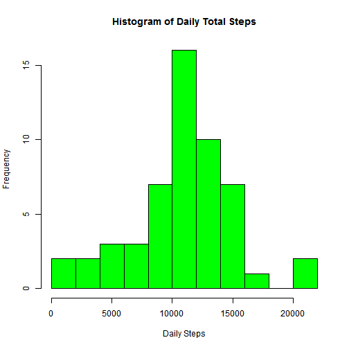
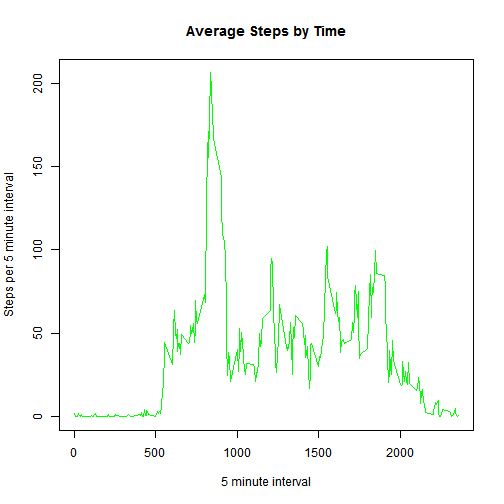
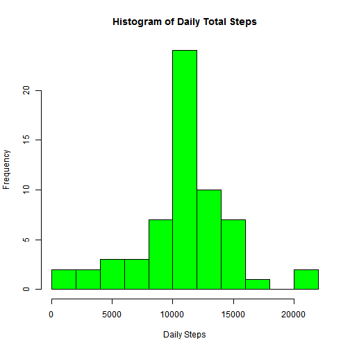
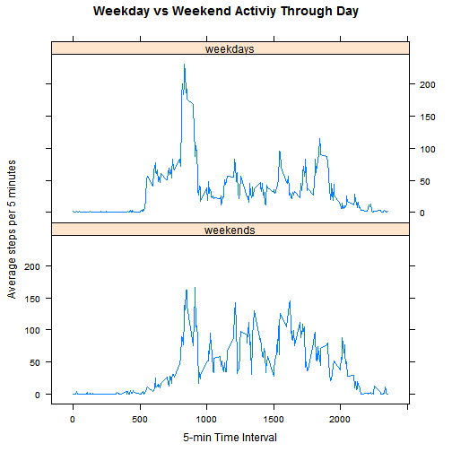

#Loading and Processing Data
This code reads activity.csv into R, then converts dates to POSIXct


```r
activity <- read.csv('activity.csv')
activity$date <- as.POSIXct(strptime(activity$date, format = "%Y-%m-%d"))
```

#What is mean total number of steps taken per day?
Create a new data frame with NA values removed, create a vector of the total
steps by day, and plot a histogram of total steps taken each day.
Then calculate the mean and median of this vector.


```r
#calculate the total steps per day

activity.clean <- activity[!is.na(activity$steps),]

steps.by.day <- tapply(activity.clean$steps,factor(activity.clean$date), 
                       FUN = sum)

hist(steps.by.day, col = 'green', breaks = 10, 
     xlab = "Daily Steps",
     main = "Histogram of Daily Total Steps")
```

 

```r
steps.mean <- mean(steps.by.day)
print(paste('Mean total daily steps is',toString(steps.mean)))
```

```
## [1] "Mean total daily steps is 10766.1886792453"
```

```r
steps.med <- median(steps.by.day)
print(paste('Median total daily steps is',toString(steps.med)))
```

```
## [1] "Median total daily steps is 10765"
```

#What is the average daily activity pattern?
Calculate average activity by time interval, and make a line plot to show
average daily activity. Find the time interval with the highest average daily
steps.


```r
#calculate the average of time steps by interval
steps.by.time <- tapply(activity.clean$steps,factor(activity.clean$interval), 
                       FUN = mean)

#vector of all intervals in day
daily.ints <- unique(activity.clean$interval)

#plot the line graph of steps over the day
plot(daily.ints,steps.by.time, type = 'l',
    ylab = 'Steps per 5 minute interval',
    xlab = '5 minute interval',
    main = 'Average Steps by Time',
    col = 'green'
    )
```

 

```r
max.steps = max(steps.by.time)
highest.interval = daily.ints[which(steps.by.time == max.steps)]
print(paste('Time interval with highest average steps is',
      toString(highest.interval)))
```

```
## [1] "Time interval with highest average steps is 835"
```

#Imputing missing values
Calculate the number of missing values in the data set. To fill in these missing
values, I will find the interval corresponding to each missing value, then fill
in the average # of steps over that interval for the days in which it is not 
missing. Then create a new dataset with missing values filled in, create 
histogram of total daily steps, and report mean and median total daily steps.


```r
print(paste('The number of missing values in the dataset is',
            sum(is.na(activity$steps))))
```

```
## [1] "The number of missing values in the dataset is 2304"
```

```r
#user defined function that checks if x is missing, if it's not leave it alone,
#if it is, look up the matching interval and return the average steps across 
#that interval from other days where the value exists
naReplace <- function(x, y) {
    if (is.na(x)){
        avg <- steps.by.time[which(daily.ints == y)]
    return(avg)
    } else {
        return(x)
    }
}

activity$steps <- mapply(function(x, y) naReplace(x,y), 
                    x = activity$steps, y = activity$interval)

new.steps.by.day <- tapply(activity$steps,factor(activity$date), 
                       FUN = sum, na.rm = TRUE)

hist(new.steps.by.day, col = 'green', breaks = 10, 
     xlab = "Daily Steps",
     main = "Histogram of Daily Total Steps")
```

 

```r
new.steps.mean <- mean(new.steps.by.day)
print(paste('With inputed missing values, mean total daily steps is',
            toString(new.steps.mean)))
```

```
## [1] "With inputed missing values, mean total daily steps is 10766.1886792453"
```

```r
new.steps.med <- median(new.steps.by.day)
print(paste('With inputed missing values, median total daily steps is',
            toString(new.steps.med)))
```

```
## [1] "With inputed missing values, median total daily steps is 10766.1886792453"
```

The mean value is unchanged by filling in missing values with the average value
for each interval. The median is now slightly higher and equal to the mean.

#Are there differences in activity patterns between weekdays and weekends?

Create a new column in the main data frame with each weekday string in it,
then convert these weekday strings into either "weekend" or "weekday." Split
the data frame using this weekend coding, then calculate the average activity
over 5-minute intervals for both weekends and weekdays. Make a panel plot showing
the difference in activity by time interval for weekends and weekdays.

```r
weekend = c("Saturday","Sunday")
activity$weekend <- weekdays(activity$date)
activity$weekend <- sapply(activity$weekend, function(x) if(x %in% weekend){
    'weekend'} else {'weekday'})

#split into two data frames containing weekday and weekend data
activities <- split(activity, factor(activity$weekend))

weekends <- activities[[2]]
weekdays <- activities[[1]]

weekend.steps <- tapply(weekends$steps,factor(weekends$interval),FUN = mean)
weekday.steps <- tapply(weekdays$steps,factor(weekdays$interval),FUN = mean)

weekends <- data.frame(x = daily.ints, y = weekend.steps)
weekdays <- data.frame(x = daily.ints, y = weekday.steps)


library(lattice)
xyplot(y ~ x | which, make.groups(weekends = weekends, weekdays = weekdays),
       layout = c(1,2), type = 'l',
       xlab = '5-min Time Interval',
       ylab = 'Average steps per 5 minutes',
       main = 'Weekday vs Weekend Activiy Through Day')
```

 
